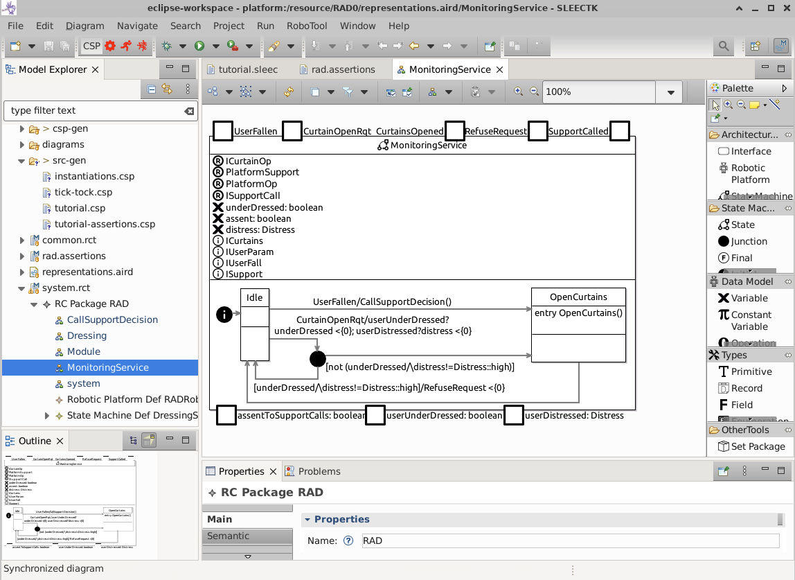
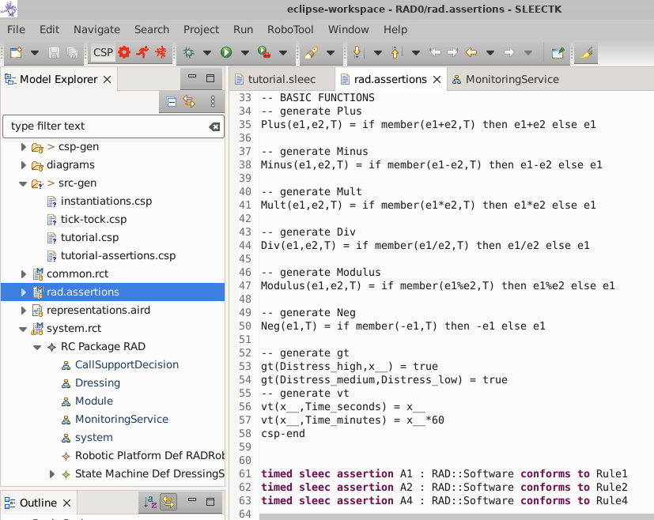
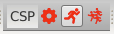
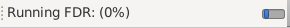

# SLEEC-tutorial

This repository contains a Dockerfile that incorporates [LEGOS-SLEEC](https://github.com/Kevin-Kolyakov/sleec-intellij-plugin) and [SLEEC-TK](https://github.com/UoY-RoboStar/SLEEC-TK/) in a single environment that can be used from a web browser. The image targets the Intel/AMD64 architecture but can be executed on macOS under Rosetta emulation, which should be enabled by default for [Docker](https://docs.docker.com/desktop/setup/install/mac-install/).

## Pre-requisites

* Docker (Intel/AMD64 or Apple Silicon under emulation)

## Usage
To execute the prebuilt docker image, open a terminal and use the command:
```
docker run --platform linux/amd64 -it --name sleec-tutorial -p 8080:8080 ghcr.io/uoy-robostar/sleec-tutorial:main
```
If using the [Zenodo artifact](https://doi.org/10.5281/zenodo.18945970), locate the file `docker-image.tar.gz`, open a terminal and instead run the following commands:
```
docker load -i docker-image.tar.gz
docker run --platform linux/amd64 -it --rm -p 8080:8080 sleec-tutorial:latest
```
After a short while, you should then be able to open a web browser at [http://localhost:8080](http://localhost:8080) to interact with the Linux-based XFCE4 desktop environment as reproduced in the screenshot below. The window can be resized as needed.


### Building the Docker image (optional)
To build the Docker image in this repository from scratch use the command:
```
docker build --platform linux/amd64 -t sleec-tutorial .
```

### SLEEC-TK
To use SLEEC-TK for analysis, you should, first of all, setup the CSP model-checker [FDR4](https://cocotec.io/fdr/) following the instructions below.

#### Install and activate FDR4
To setup FDR4, click on the shortcut in the desktop named `FDR4 (Launch or Install)`. A terminal will open, and if FDR is not yet installed it will be automatically installed. At the end, press Enter to launch FDR and proceed to obtain a license following the instructions on the screen. You can then close the FDR window that appears afterwards.

#### Running SLEEC-TK
To run SLEEC-TK, double-click on the `SLEEC-TK` shortcut on the desktop. The Eclipse launcher will appear, followed by a dialog asking for selecting a workspace path. If asked, you can accept the default `/home/sleec/eclipse-workspace` by clicking on `Launch`.

#### Reproducing results of pair-wise consistency validation
In SLEEC-TK, a file with extension `file.sleec` leads to the automatic generation of four files under the folder `src-gen` that are used as part of model-checking with FDR4:

* `instantiations.csp` : In this file, the user can override the domain for the type of numeric types used in the SLEEC rules.
* `tick-tock.csp` : This is a mechanisation for FDR of the `tock-CSP` semantics and related operators.
* `file.csp` : This file contains the `tock-CSP` semantics of SLEEC rules defined in `file.sleec`.
* `file-assertions.csp` : This file contains assertions for verification with FDR of conflicts and redundancies, as explained next.

**Note 1**: The above files can be re-generated anew by triggering a clean of the Eclipse project, namely, by selecintg `Project` from the menu bar, followed by `Clean...`.

**Note 2**: In the case of the `tutorial.sleec` file provided in the sample project, the generated files are named `tutorial.csp` and `tutorial-assertions.csp`.

The file `file-assertions.csp` will contain assertions for identifying conflicts and redundancies for SLEEC rules as described in Section 3.1 of the tutorial paper. For example, the file `tutorial-assertions.csp` can be loaded `tutorial-assertions.csp` using the FDR graphical interface by right-clicking on `tutorial-assertions.csp` under the Model Explorer view, and selecting `Open With` > `Other`, then selecting the External program `FDR`, as reproduced below.


If successful, this will show a window similar to that reproduced below.


Here, the pane on the right lists assertions related to the SLEEC Rules. We explain below, how to use the graphical interface of FDR to reproduce the traces of Section 3.1.

##### Traces

To reproduce `Trace 1 for Rule1` load `tutorial-assertions.csp` into FDR. Then, first type `external chase` in FDR's interactive prompt to the left followed by the Enter key. Then, type `:probe chase(SLEECRule1)` to bring up FDR's probing interface of the `tock-CSP` semantics for Rule1. This is shown as a tree, which can be used to follow a sequence of interactions, as reproduced below.


In this case, the trace to be reproduced is `CurtainOpenRqt, userUnderDressed.false, userDistressed.medium, tock, CurtainsOpened`, as shown at the bottom of the screenshot. Arrow keys or the mouse cursor can be used to step through the possible interactions.

The same procedure can be used to explore `Trace 3 for RuleB` and `Trace4 for RuleA`, that is, `:probe chase(SLEECRuleB)` and `:probe chase(SLEECRuleA)`, reproduced below.


##### Conflicts

Conflict checking of a pair of rules, for example, Rule1 and Rule2, is encoded as two assertions `SLEECRule1Rule2 :[deadlock free]` and `SLEECRule1Rule2CF :[divergence free]`, as seen in the screenshot below as `tutorial-assertions.csp` is loaded into FDR:

Clicking on `Check` for both reveals that they both `Passed`, indicating the the rules are not conflicting as expected.

For analysis of conflicts discussed in Section 3.1 of the paper, we consider the set of SLEEC rules (RuleA, RuleB, and RuleC), defined in Listing 1.2, and specified at the end of the file `tutorial.sleec`. By scrolloing the `Assertions` list in FDR, it is possible to find the pair of assertions
`SLEECRuleARuleB :[deadlock free]` and `SLEECRuleARuleBCF :[divergence free]`. Clicking on `Check`
reveals that the first assertion does not pass, indicating that there is a conflict. The counter-example is produced by clicking on `Debug`:


This should reveal the counter-example as reproduced above `CurtainOpenRqt, userUnderDressed.true, userUnderDressed.true,userDistressed.high, tock, tock, tock, tock, tock, tock`.

##### Redundancies

Redundancies, as discussed in Section 3.1 of the paper, are encoded via two refinement assertions, for rules whose alphabet has some event in common. 

With `tutorial-assertions.csp` open in FDR, the checking of redundancy between rules RuleC and RuleB is encoded by assertions `not RuleB_wrt_RuleC [T= RuleC_wrt_RuleB` (is Rule C redundant wrt. Rule B?) and `not RuleC_wrt_RuleB [T= RuleB_wrt_RuleC` (is RuleB redundant wrt. Rule C?).

Checking `not RuleC_wrt_RuleB [T= RuleB_wrt_RuleC` produces a counter-example similar to that reported in the paper as `Trace 5`, a scenario indicating that `RuleB` is not redundant with respect to `RuleC`. The counter-examples obtainable from FDR contain several permutations across the 60 occurrences of the subsequence `(userUnderDressed.X, tock)` mentioned in the paper, corresponding to all possible reading of value `true` or `false` for `userUnderDressed`. 

Proof that `Trace 5` is indeed a genuine counter-example of the negated version of the assertion, i.e. `RuleC_wrt_RuleB [T= RuleB_wrt_RuleC` can be obtained using the file `tutorial-assertion-trace5.csp`, included for completeness, that contains two assertions:

* `assert not RuleC_wrt_RuleB :[has trace [T]]: <trace ...>` : where `trace` is `Trace 5` reproduced in the paper, this assertion checks that `trace` is not a valid trace of `RuleC_wrt_RuleB`.
* `assert RuleB_wrt_RuleC :[has trace [T]]: <trace ...>` : similarly `trace` is `Trace 5`, and this assertion checks that `trace` is a valid trace of `RuleB_wrt_RuleC`, that is, it is possible.

Checking that both assertions pass indicates that `trace` is a valid counter-example, that is, the refinement `RuleC_wrt_RuleB [T= RuleB_wrt_RuleC` does not hold, as `trace` is a valid observation of `RuleB_wrt_RuleC` but not `RuleC_wrt_RuleB` as expected.

#### Reproducing results of conformance verification of design models
The design models reproduced in Section 4 of the paper can be opened from the provided `RAD0` Eclipse project. We observe that, upon loading the project, you will be asked whether to open these diagrams. To manually open `MonitoringService` (Figure 4 in the paper), one of the included RoboChart diagrams, select the file `system.rct` under the `Model Explorer` view, and expand the tree structure: `RC Package RAD`, followed by double clicking on `MonitoringService`. The diagram will then appear to the right as reproduced below.



The RoboChart models of Figures 5 and 6 in the paper are similarly available under `RC Package RAD`. 

##### Verification
Similarly to the pair-wise validation of SLEEC rules, conformance verification also requires that FDR4 has been installed and activated. The assertions are included in the file `rad.assertions` that can be edited by double-clicking, as reproduced below.



Below, we provide two approaches for checking conformance assertions. The first leverages RoboTool's integration with FDR and produces an table in HTML format (Figure 7 of the paper), whereas the second allows exploring results in more detail, namely by inspecting any counter-examples.

###### Checking using SLEEC-TK's integration with FDR

Before verifying the assertions, configure FDR4 for use with SLEEC-TK by selecting `Window` from the menu bar, and then choosing `Preferences`. In the dialog that appears, using the tree show on the left select `RoboChart` > `Analysis`, then type the path `/opt/fdr`. Eclipse may ask you for `Preference Synchronization`, choose `No - Preferences will be saved locally.`, followed by `Ok` twice.

With the file `rad.assertions` open in SLEEC-TK, locate the red icons next to the label `CSP` below the Eclipse menu bar. Click on the second icon to the right of the label `CSP` in red:



If successful, you should see a status bar at the bottom of SLEEC-TK:



At this point, FDR is running in the background to check that assertions `A1` to `A4`, specified in the file `rad.assertions` are satisfied. **This process may take a significant amount of time to complete.** At the end, an HTML report is produced.

###### Checking using FDR directly
To check conformance assertions directly with FDR, instead, select the file under the folder `csp-gen/rad_assertions.csp` and load it into FDR. Assertions `A1` to `A2` are listed in order and can be checked from within FDR. `A1` and `A2` should pass while `A3` fails. `Trace 6`, in particular, can be obtained by examining the last assertion with `csp-gen/rad_assertions.csp` loaded into FDR.

### LEGOS-SLEEC
To use LEGOS-SLEEC for set-wise well-formedness analysis, you should, use the docker, or follow this guide which explains how to install LEGOS-SLEEC and the Sleec plugin in your IntelliJ IDEA environment. 

#### Installation Instructions

#### Method 1: Install from Github Repository

###### Step 1: Download IntelliJ and Python
1. Download and install IntelliJ IDEA 2021.3.3. You can get the Community Edition for free when you scroll down [here](https://www.jetbrains.com/idea/download/other.html).
2. Download and install Python from the official website [here](https://www.python.org/downloads/).
3. Make sure to have git installed [here](https://git-scm.com/downloads).

###### Step 2: Clone the Repository
1. Launch IntelliJ IDEA.
2. Click on **Get from VCS**.
3. Enter the following URL to clone the repository:
   ```
   https://github.com/Kevin-Kolyakov/sleec-intellij-plugin.git
   ```
4. Wait for the files to be configured.

###### Step 3: Configure and Run the Plugin
1. In the **Current File** dropdown menu, change the run configuration to **Run Plugin**.
2. Run the program. Note: Initial errors may occur; these are normal and only happen the first time.

###### Step 4: Install Prerequisites
Ensure you have the following prerequisites installed before running the Sleec IntelliJ Plugin:
1. Python 3.5 or later.
   ```
   pip install z3-solver
   ```
   ```
   pip install pysmt
   ```
   ```
   pip install ordered-set
   ```
   ```
   pip install textx
   ```
   ```
   pip install termcolor
   ```

###### Step 5: Access the Sleec Template
1. In the File tab, click on New, then Project, then select the **Sleec Templates** and click next to access all the example files in the Evaluation folder.
2. To add new files, add them to the Evaluation folder and then save them.
3. To run the Sleec files in the template, click on any of the icons in the top right corner of the screen and select a SLEEC file.

###### Step 6: Update the Project
1. Open IntelliJ IDEA and navigate to the **Terminal** tab at the bottom of the screen.
2. Ensure you are in the project's root directory. If not, navigate to it using:
   ```
   cd path/to/your/sleec-intellij-plugin
   ```
3. Pull the latest updates from the repository by running:
   ```
   git pull origin master
   ```
4. Wait for the project to update and reconfigure if necessary.

---

##### Method 2: Install from JetBrains Marketplace
1. Download and install IntelliJ IDEA 2021.3.3. You can get the Community Edition for free when you scroll down [here](https://www.jetbrains.com/idea/download/other.html).
2. Download and install Python from the official website [here](https://www.python.org/downloads/).
3. Install the following Python packages:
   ```
   pip install z3-solver
   ```
   ```
   pip install pysmt
   ```
   ```
   pip install ordered-set
   ```
   ```
   pip install textx
   ```
   ```
   pip install termcolor
   ```
5. Open **IntelliJ IDEA**.
6. Navigate to **File > Settings > Plugins** (or **Preferences > Plugins** on macOS).
7. In the **Plugins** settings, click on the **Marketplace** tab.
8. Search for `Sleec` in the search bar.
9. Locate the Sleec plugin in the results and click **Install**.
10. Restart IntelliJ IDEA when prompted.
11. In the File tab, click on New, then Project, then select the **Sleec Templates** and click next to access all the example files in the Evaluation folder.
12. To run the Sleec files in the template, click on any of the icons in the top right corner of the screen and select a SLEEC file.

Your Sleec plugin is now ready to use!

---

##### Method 3: Install from a Virtual Image (OVA File)

1. Download the Sleec `.ova` file from the official repository or distribution source. [Download the `.ova` file here](https://drive.google.com/file/d/1ATkwtveFr1q4Fy9RJ0iEpHA_iUGXE-7F/view?usp=sharing)
2. Install a virtual machine software such as **VirtualBox**:
   - [Download VirtualBox](https://www.virtualbox.org/)
3. Open your virtual machine software and select the option to **Import Appliance** or **Import Virtual Machine**.
4. Browse to the downloaded `.ova` file and follow the prompts to import it.
5. Once the virtual machine is imported, adjust the hardware settings (e.g., RAM, CPU) as needed to match your system.
6. Start the virtual machine.
7. The virtual machine will load an environment with IntelliJ IDEA pre-configured with the Sleec plugin.
8. To launch IntelliJ IDEA in the Ubuntu environment, open the terminal and run:
   ```bash
   intellij-idea-community
   ```
9. If prompted for a password in the virtual machine, use:
   ```
   changeme
   ```

Your Sleec plugin is now ready to use within the virtual machine!

---
## Reproducing Results of Set-wise Well-Formedness Validation

LEGOS-SLEEC supports several forms of **set-wise well-formedness analysis** for SLEEC rule sets. These analyses detect issues that may arise when considering multiple rules together, including **situational conflicts, restrictiveness, redundancy, and insufficiency**.

To reproduce the results shown in the tutorial paper, follow the steps below.

---

### Step 1: Load the Case Study

1. Open **IntelliJ IDEA** with the **SLEEC plugin** installed.
2. Create a new SLEEC project using: File → New → Project → SLEEC Templates
3. Copy the `LEGOS_SLEEC_ALMI.sleec` definitions and rules from [here](LEGOS_SLEEC_ALMI.sleec)
4. Place the file inside the **Evaluation** or **Case Studies** folder of the project.

This file contains the SLEEC rules used in the tutorial experiments.

---

### Step 2: Run Well-Formedness Analyses

LEGOS-SLEEC provides several analysis buttons in the IntelliJ toolbar. Each button corresponds to a specific class of well-formedness checks.

Below we describe how to reproduce each result reported in the tutorial.

---

### Situational Conflict Detection

Situational conflicts arise when **two or more rules may require incompatible actions under the same situation**.

1. Click the **Situational Conflict** analysis button in the toolbar as shown below: 
2. Select the file `LEGOS_SLEEC_ALMI.sleec`.
3. The analyzer will detect rule combinations that may lead to conflicts.
The diagnostic highlights the rules involved in the conflict and the conditions under which the conflict occurs.

---

### Restrictiveness Detection

Restrictiveness occurs when **a rule unnecessarily constrains behaviour**, preventing legitimate system actions.

To reproduce:
1. Click the **Restrictiveness Analysis** button in the toolbar, as shown below: 
2. Select the `LEGOS_SLEEC_ALMI.sleec` file.
3. The tool analyzes whether some rules overly restrict the system behaviour.
The diagnostic indicates the rules responsible for restricting behaviour and the corresponding conditions.

---

### Set-wise Redundancy Detection

Set-wise redundancy arises when **a rule is fully implied by other rules in the set**, making it unnecessary.

To reproduce:

1. Click the **Redundancy Analysis** button in the toolbar, as shown below: 
2. Select `LEGOS_SLEEC_ALMI.sleec`.
3. The tool computes whether any rule can be inferred from others.
The diagnostic identifies redundant rules and the rule combinations that imply them.

---

### Insufficiency Detection

Insufficiency occurs when **rules fail to specify required behaviour for certain situations**, leaving gaps in the specification.

To reproduce:

1. Click the **Insufficiency Analysis** button, as shown below: 
2. Select `LEGOS_SLEEC_ALMI.sleec`.
3. The tool searches for scenarios where no rule applies.
The diagnostic reports situations where the rule set is incomplete.


